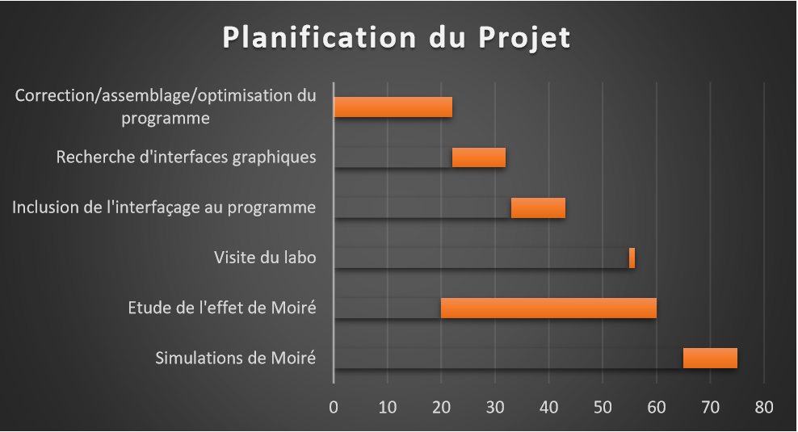
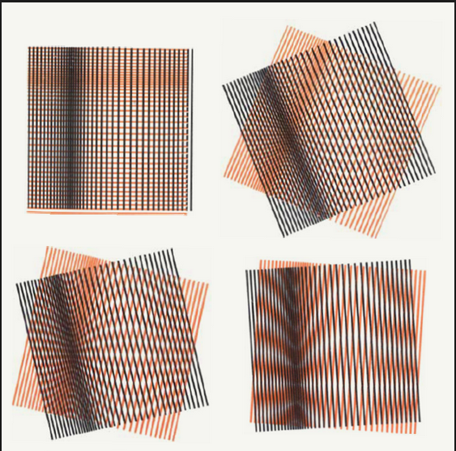

= Projet IPCMS

:toc:

== Contexte du projet

Dans le cadre de l'UE Projet de la première année du Master de Calcul Scientifique et Mathématique de l'Information à l'Université de Strasbourg, nous avons collaboré avec l'IPCMS, afin de répondre à une problématique qui leur était posée, et de nous permettre de s'approcher du monde proffessionnel et de découvrir la géstion de projet vis-à-vis d'un client.

L'Institut de Physique et de Chimie de Strasbourg (IPCMS), basé à Cronenbourg, est spécialisé et reconnu dans le domaine des nanomatériaux, aussi bien dans la fabrication que dans la caractérisation. Ces nano-objets trouvent des applications dans le magnétisme, l'optique ultra-rapide, la microscopie electronique ou encore la biophysique.

== Nos objectifs

Lors d'une expérience de microscopie sur des nanomatériaux, les chercheurs récupèrent un fichier au format dat, qu'ils traitaient d'une part avec un programme python, et dont ils visualisaient des image d'une autre part avec imageJ. Notre objectif était donc de fournir un unique programme python afin d'à la fois extraire les images ainsi que de les agencer pour pouvoir tracer des profils temporels à l'aide d'une interface graphique appropriée. Le programme devait également permettre de faire des coupes : on peut observer les différentes strates de l'objet étudié, séparément les unes des autres. Enfin nous voulions pouvoir afficher le graphe de la décroissance lumineuse en fonction du temps.

Notre but est donc de fournir un programme python regroupant toutes les étapes de l'analyse des données. Pour cela nous pouvions nous baser sur un premier programme écrit par Monsieur Ziegler mais qui nécessitait un travail de réécriture. Un premier travail consistait à organiser ce code en supprimer les redondances, en factorisant et optimisant les étapes, l'objectif étant donc de fournir un code lisible, clair et efficace.
Afin d'aller un peu plus loin et pour améliorer l'expérience des chercheurs, nous voulions travailler à proposer une interface graphique simple mais permettant des manipulations de la visualisation des résultats, de différentes coupes de l'objet etc.
De plus , les chercheurs sont parfois confrontés à des matériaux dont la réaction au laser ne permet pas de capturer la réaction de façon conventionnelle, car les caméras utilisable sont de trop faible résolution. Il nous était donc demandé de mettre au point une seconde partie du programme qui va utiliser les propriétés des franges de Moiré pour pouvoir analyser le matériau étudié de manières plus précise. 

== Plannification et organisation du travail

Nous avions ainsi des parties bien distinctes qui se déssinaient : une première consistait à réécrire le programme python, une seconde de choisir et parametrer une interface graphique appropriée pour la visualisation des données, et enfin l'étude du phénomène de Moiré, ainsi que de réaliser quelques simulations. Le choix a été fait de ne pas nous diviser ces étapes, même si nous étions également trois, afin de ne pas divisier le projet en trois sous-projets, qui auraient chacun eu une part importante d'indépendance, et auraient pu instaurer une non-compréhension ou non-connaissance des parties réalisées par les autres. Nous avons donc choisi de tous travailler ensemble sur chacune de ses parties, l'une après les autres.
Quant à la répartition du travail, nous avons essentiellement travaillé ensemble en cours sur le programme python, effectuions les recherches chacun de notre coté et tous sur les mêmes sujets, afin de pouvoir par la suite comparer nos compréhensions, et ainsi améliorer la nôtre individuelle. Chacun d'entre nous étions tour à tour responsables de la rédaction d'un résumé du sujet étudié ou du travail effectué.

Durant la réalisation de ce projet, nous avons malgré tout été confrontés à certains difficultés.
Tout d'abord, il n'est pas toujours aisé de s'organiser et de réussir à travailler régulièrement sur un sujet, notamment en cours d'année avec d'autres projets et travaux qui s'additionnent.
D'autre part, notre sujet semblait à première vue essentiellement informatique. Mais assez rapidement il nous a été demandé de rentrer dans des théories physiques relativement poussées, ce dont nous n'avons pas ou plus l'habitude. 
Enfin, le fait que toute la documentation sur le sujet que l'on pouvait trouver était uniquement en anglais pouvait nous ralentir, et parfois nous induire en erreur dans la compréhension des thématiques.

== Notre programme

Pour pouvoir visualiser les images obtenues grâce aux expériences et que les chercheurs puissent par la suite les manipuler sans avoir besoin de toucher au code, nous avions besoin d'une interface graphique adaptée. +
Nous avons donc commencé par en regarder deux similaires, pyplot et bokeh. Elles sont toutes les deux très performantes et permettent de manipuler très facilement des graphiques et des courbes, mais elles ne permettent pas la visualiation d'images.
Après avoir regardé d'autres interfaces déjà existantes, mais moins importantes, nous avons conclu qu'il n'y avait que deux solutions viables. +
Nos solutions possibles

* Créer notre propre interface graphique, par exemple grâce à Tkinter
* Utiliser matplotlib la librairie standard utilisée en cours

Notre programme est donc une interface graphique utilisant matplolib et ses widgets permettant l'analyse de fichier .dat. Il extrait en premier ces données pour les transformer en tableau numpy qui permettront de distinguer chaque images.
Nous avions ensuite besoin de 2 petites fonctions.
L'une qui permet d'afficher l'intensité d'un ensembles de point en fonction de la profondeur dans l'ensemble d'image.
Et l'autre effectue une coupe des images en faisant une rotation d'axes dans le tableau numpy.
Le plus gros du programme est l'adaptation de différents widgets déjà existants sur matplolib,boutons, slider et la selection.
Il a fallu les rendres compatibles comme par exemple le fait que le color map ne change pas en faisant bouger le slider.
Nous avons également écrit un petit programme qui illustre le phénomène de moiré.

== Les méthodes utilisées en laboratoire

=== La microscopie par fluorescence

La microscopie par fluorescence s'oppose aux méthodes habituelles de réflexion ou absorption de la lumière. En effet certains objets ont la propriété d'émettre par eux-même de la lumière après avoir absorbé les photons (particules véhiculées par les ondes lumineuses) d'une lumière plus importante. La différence entre la longueur d'onde absorbée et celle émise par le corps peut être décrite par le déplacement de Stokes. Ainsi, on envoie un faisceau lumineux d'une longueur d'onde connue et séléctionnée spécialement pour être absorbée par différentes parties du corps étudiés, qui vont ainsi émettre une lumière attendue précisément et detectée par le microscope. Une sélection différente de longueur d'onde émise entraînera donc la fluorescence d'une partie différente de l'objet.
Heureusement, même si tout élément dans la nature n'est pas fluorescent, on peut marquer celui-ci à l'aide de fluorochromes; on appelle ce phénomène la fluorescence secondaire, par opposition à la fluorescence primaire.

=== La technique pompe/sonde

L'IPCMS a recourt à une méthode pompe/sonde afin de pouvoir observer les plus petites particules. Cette technique consiste à envoyer une impulsion laser très courte et intense (la pompe) afin d'exciter les particules. Dans un second temps, la sonde envoie juste après la pompe une impulsion plus faible afin de mesurer cette excitation. En répétant l'opération et en faisant varier l'intervalle de temps entre la pompe et la sonde on peut ainsi reconstituer l'évolution de l'excitation au cours du temps. Cette technique permet de visualiser les mouvements au coeur même d'un atome.

image::labo.JPG[Photo du montage de l'expérience]

=== Microscopie à illumination structurée

La microscopie à illumination structurée est une technique de microscopie à fluorescence de super-résolution. Avec un microscope classique, la résolution est limitée par la difraction; en effet, la longueur d'onde d'un rayon lumineux a une limite inférieure. Ce principe a été théorisé par Abbe dès 1873. Les différentes méthodes comme le microscope confocal ne permettaient uniquement de s'approcher de cette limite (approximativement 200nm), mais pas d'aller au delà. Mais depuis les années 1997-1998 la technique d'illumination structurée à changé la donne. L'idée est d'illuminé l'échantillon à l'aide d'un faisceau structuré spatialement, qui permet d'obtenir des informations en haute résolution habituellement inaccessible sous forme de franges de Moiré. 
Cette méthode permet d'améliorer la résolution d'un facteur 2 au moins, pouvant ainsi descendre aisément à 100nm. Avec cette méthode, la limite de résolution n'existe pas en théorie, mais en pratique le ratio signal/bruit des données détermine la résolution obtenue. A ce jour le reccord de résolution par cette méthode est descendu à 50nm.

=== Le phénomène de Moiré

Le Moiré est un contraste changeant avec la déformation d'un objet indépendamment des effets d'ombre. Ce que l'on appelle Moiré est une figure formée de lignes sombres et claires produites par la superposition de deux réseaux réguliers, formés de lignes globalement parallèles. Il s'agit d'un phénomène d'interférences spatiales entre ces réseaux. Avec un petit microscope, placer une simple grille entre l'objectif et l'objet peut suffir. On enregistre le cliché, puis on translate et/ou rotationne la grille. On prend ainsi une multitude de clichés que l'on convolue ensemble pour obtenir l'unique image à étudier. On note que la superposition des réseaux est une simple multiplication des deux éléments. Enfin, connaissant les caractéristiques ainsi que les phases de la grille translatée et convoluée, one sait que les franges de Moiré obtenues contiennent les informations de la structure étudiée, et on peut procéder à une déconvolution afin de retrouver l'image d'origine.

Dans le cas de l'IPCMS, ce n'est pas une grille mais le faisceau structuré spatialement que l'on utilise comme réseau connu, le second réseau étant l'objet étudié.

Pour comprendre, on visualise le corps étudié sous sa transformée de Fourier. Dans cette représentation, les informations basse résolution demeurent proches de l'origine, tandis que les information de haute résolution se trouve beaucoup plus loin.
Pour un microscope usuel, celui-ci est limité par la limite de difraction latexmath:[\d], autour de 200nm pour les meilleures lentilles. Il peut donc uniquement détecter les informations se trouvant dans un rayon de latexmath:[\fract{1}{d}] autour de l'origine de son espace réciproque. C'est également la région visible à première vue par ma méthode d'illumination structurée. Les deux méthode voient donc la même chose dans ce cercle, mais la seconde transpose les information à lextérieur de ce cercle où les informations devienennent observables.
En prenant comme exemple une structure lumineuse consistant en un réseau de lignes sinusoïdales. Sa transformée de Fourier n'a que 3 points différents de zéro, le centre du cercle, et deux alignés et opposés avec l'origine, la droite étant définie par la direction de la grille sinusoïde, et leur distance inversement proportionnelle à l'éspacement des lignes de la grille. L'image obtenue ainsi contient donc l'objet d'origine ainsi que des franges de Moiré correspondant aux informationx dont les positions dans l'espace réciproque ont été décalées, par rapport à celles sités plus haut. Ainsi, à partir du cercle de départ, on peut ajouter au champs de vision des cercles de même diamètre dont le centre peut aller jusqu'à la trace du premier, formant ainsi une zone doublement plus grande que la première.

=== Formation de l'image et reconstruction

En microscopie à fluorescence les données enregistrées latexmath:[D\left(\vec{r}\right)] peuvent être décrites par une convolution de la fluorescence émise latexmath:[E\left(\vec{r}\right)] avec la fonction d'étalement du point du microscope (aussi appelée réponse impulsionnelle optique) latexmath:[h\left(\vec{r}\right)] : 
latexmath:[D \left( \vec{r}\right)=[E\otimes h\]\left(\vec{r}\right)]
. A des constantes près, la distribution de lumière émise peut être écrite comme le produit de la densité de fluorophore latexmath:[S\left(\vec{r}\right)] et de l'illumination effective latexmath:[I\left(\vec{r}\right)] : latexmath:[E\left(\vec{r}\right)=S\left(\vec{r}\right)I\left(\vec{r}\right)]. Dans le cas d'une réponse linéaire de l'échantillon à la lumière, l'illumination effective est identique à l'illumination réelle. Si la réponse est non linéaire, le processus d'illumination et d'émission peut être écrit comme une réponse linéaire à une illumination effective modifiée, qui elle est non linéaire. Considérons la distribution de l'illumination comme comprenant un nombre fini latexmath:[M] de composantes, qui peuvent être séparés en parties axiales latexmath:[\left(z\right)] et latérales latexmath:[\left(x,y\right)] : latexmath:[I\left(\vec{r}_{xy},z\right)=\sum_{m}I_{m}\left(z\right)J_{m}\left(\vec{r}_{xy}\right)]. Chaque composante latérale doit être une onde harmonique contenant une unique fréquence spatiale latexmath:[\vec{p}], soit latexmath:[J_{m}\left(\vec{r}_{xy}\right)=\exp\left\{ i\left(2\Pi\vec{p}\cdot\vec{r}_{xy}+\varPhi_{m}\right)\right\} ]. Ici latexmath:[\varPhi] symbolise la phase de la m-ième composante. Comme l'intensité de l'illumination doit être une valeur réelle, chaque composante complexe de l'illumination latexmath:[J_{m}\left(\vec{r}\right)] doit avoir un conjugué latexmath:[\overline{J_{m}\left(\vec{r}\right)}]. Ceci revient à numéroter les composantes de latexmath:[m=-\left(M-1\right)/2] à latexmath:[\left(M-1\right)/2] et définir latexmath:[\vec{p}_{-m}=-\vec{p}_{m}] ainsi que latexmath:[\varPhi_{-m}=-\varPhi_{m}]. Si les fréquences spatiales latexmath:[\vec{p}_{m}] décrivent un modèle harmonique, elles seront des multiples d'une unique fréquence fondamentale latexmath:[\vec{p}] :latexmath:[\vec{p}_{m}=m\vec{p}]. Ainsi, si ce modèle est symétrique et demeure rigide après les translations entre les images, les phases des fréquences individuelles seront des multiples de la phase de la fréquence fondamentale latexmath:[\varPhi] : latexmath:[\varPhi_{m}=m\varPhi].
Si la partie axiale de l'illumination reste fixe vis-à-vis du l'objectif du microscope durant la refocalisation, son effet peut être incorporé dans la fonction d'étalement : latexmath:[h_{m}\left(\vec{r}\right)=h\left(\vec{r}\right)I_{m}\left(z\right)]. La formation de l'image peut ensuite être décrite par un échantillon illuminé par les composantes latérales de l'illumination structurée uniquement, latexmath:[J_{m}\left(\vec{r}\right)], pendant que chaque composante est couplée avec sa fonction d'étalement respective latexmath:[h_{m}\left(\vec{r}\right)]. On peut donc écrire les données acquise par cette méthode comme 
latexmath:[D\left(\vec{r}\right)=\sum_{m}\left\{ [S\left(\vec{r}\right)J_{m}\left(\vec{r}_{xy}\right)\]\otimes h_{m}\left(\vec{r}\right)\right\} ]
ou dans l'espace de Fourier 
latexmath:[D\left(\vec{k}\right)=\sum_{m}\left\{ e^{im\Phi}\tilde{S}\left(\vec{k}-m\vec{p}\right)h_{m}\left(\vec{k}\right)\right\} =\sum_{m}e^{im\Phi}\tilde{C}_{m}\left(\vec{k}\right),\tilde{C}_{m}\left(\vec{k}\right):=\tilde{S}\left(\vec{k}-m\vec{p}\right)h_{m}\left(\vec{k}\right)]
avec les composantes de Fourier latexmath:[\tilde{C}_{m}\left(\vec{k}\right)]. Pour la méthode de l'illumination structurée, une série de généralement latexmath:[N\geq M] images sont captées pour différentes phases latexmath:[\varPhi_{n}]. On peut écrire la n-ième image de Fourier comme 
latexmath:[\tilde{D}_{n}\left(\vec{k}\right)=\sum_{m}e^{im\Phi_{n}}\tilde{C}_{m}\left(\vec{k}\right)]
ou en notation matricielle 
latexmath:[\vec{\tilde{D}}\left(\vec{k}\right)=M\vec{\tilde{C}}\left(\vec{k}\right),M_{n,m}=e^{im\Phi_{n}}]
où latexmath:[\vec{\tilde{C}}\left(\vec{k}\right)] et latexmath:[\vec{\tilde{D}}\left(\vec{k}\right)] sont des vecteurs contenant respectivement les composantes de Fourier individuelles et les images, et la matrice latexmath:[M] contient les différentes phases latexmath:[m\Phi_{n}] pour différents ordres d'illumination latexmath:[(m)] et différentes images s:[(n)].

Pour la reconstruction de l'image ne haute résolution, les composantres individuelles de Fourier latexmath:[\tilde{C}_{m}\left(\vec{k}\right)] doivent être extraites des données acquises. Cela peut être réalisé en inversant l'équiation 
latexmath:[\vec{\tilde{C}}\left(\vec{k}\right)=M^{-1}\vec{\tilde{D}}\left(\vec{k}\right)]
Si la matrice latexmath:[M] n'est pas carrée, c'est à dire qu'il y a plus d'images que de comosantes à séparer, on utilise la pseudo-inverse de Moore-Penrose latexmath:[M^{-1}:=\left(M^{\dagger}M\right)^{-1}M^{\dagger}
 ]. Le symbole latexmath:[\dagger] signifie que l'on prend la transposée conjuguée, ou bien la conjuguée hermitienne de la matrice. Pour les patrices carrées latexmath:[\left(M=N\right)] des pas de phases équidistants latexmath:[\Phi_{n}=2\varPi n/N] produiront le meilleur conditionnement et donc les meilleures composantes avec le meilleur ratio possible signal/bruit. Cependant, la séparation marchera pour tout autre pas de phase uniquement tant que latexmath:[M] n'est pas singulière.
Afin d'obtenir une amelioration de la résolution latérale, ce processus d'acquisition des données et la séparation des composantes se déroulent selon latexmath:[Q] orientations, produisant des composantes séparées latexmath:[\tilde{C}_{q,m}\left(\vec{k}\right)], où l'index latexmath:[q] représente l'orientation. C'est composantes peuvent ensuite être recombinées en utilisant une moyenne pondérée dans l'espace de Fourier couplée à un filtre de Wiener généralisé à une fonction d'aposition latexmath:[A\left(\vec{k}\right)],
latexmath:[\tilde{S}'\left(\vec{k}\right)=\frac{\sum_{q,m}\left\{ \tilde{h}_{m}^{\star}\left(\vec{k}+m\vec{p}_{q}\right)\tilde{C}_{q,m}\left(\vec{k}+m\vec{p}_{q}\right)\right\} }{\sum_{q',m'}\left\{ \left|\tilde{h}_{m'}\left(\vec{k}+m'\vec{p}_{q'}\right)\right|^{2}\right\} +w}\tilde{A\left(\vec{k}\right)}]
produisant un échantillon de latexmath:[\tilde{S}'\left(\vec{k}\right)] étages qui contiennent des informations de fréquence plus élevées que l'image à large champs latexmath:[\tilde{S}\left(\vec{k}\right)\tilde{h}\left(\vec{k}\right)]. Dans l'équation ci-dessus latexmath:[w] est le paramètre de Wiener (constant) qui est ajusté empiriquement. Le but de la fonction d'aposition est d'éviter les bords durs dans la fonction de transfert optique reconstruite, ce qui pourrait également résulter du filtre de Wiener. De cette façon, les artefacts d'anneaux dans la fonction d'étalement du point reconstruite sont paliés. 

== Remerciements

Nous tenons tout particulièrement à remercier Monsieur Ziegler et Monsieur Gilliot pour leur temps et leurs explications, ainsi que pour la visite de leur laboratoire. 
Nous souhaitons également remercier Monsieur Vigon pour ses directives et son aide précieuse.

== Bibliographie

• Super-Resolution Imaging, Peyman Milanfar, CRC Press
• Fluorescence Microscopy, Anda Cornea and P. Michael Conn, Elsevier
• Structured Illumintion Microcopy, Sara Abrahamsson, Graeme Ball, Kai Wicker, Rainer
Heintzmann and Lothar Schermelleh
• Phase Optimisation for Structured Illumination Microscopy,
Ondrej Mandula, Gerrit Best, Reto Fiolka and Rainer Heintzmann
